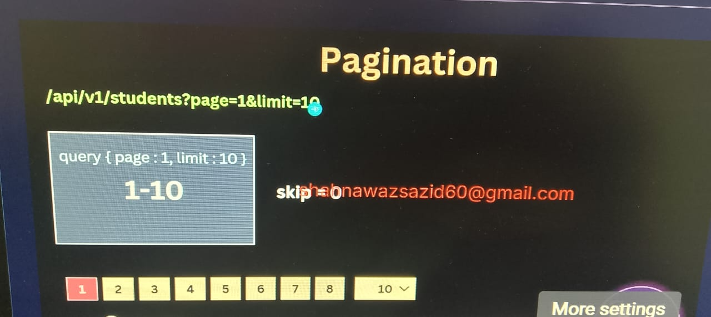
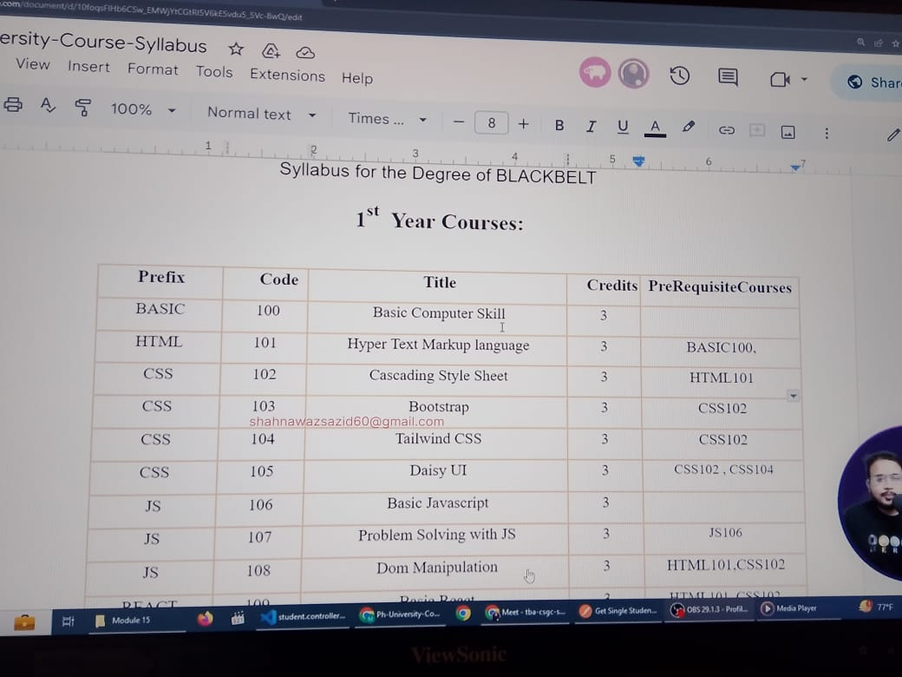

# University Management System Part -3

Part 3:

https://github.com/Apollo-Level2-Web-Dev/Level2-Batch4-PH-University-Server/tree/part-3

Requirement Analysis:

https://docs.google.com/document/d/10mkjS8boCQzW4xpsESyzwCCLJcM3hvLghyD_TeXPBx0/edit?usp=sharing

In Module 13,

We start by fixing previous bugs to ensure our code runs smoothly. We then create and validate the Academic Faculty interface and model, set up routes, controllers, and services, and test them using Postman. Next, we develop and validate the Academic Department interface and model, create controllers and routes, and test them with Postman. We handle validation for departments during creation and updates, learn to populate referencing fields, and implement the AppError class for better error management. We also explore transaction and rollback techniques, including deleting a student within a transaction. Finally, we learn how to dynamically update both primitive and non-primitive fields. This module helps you manage and validate complex data structures efficiently.

## Module Outcomes

1. Bug Fix
2. Academic Faculty CRUD
3. Academic Department CRUD
4. Transaction and Roll BACK
5. Custom AppError
6. Dynamic Update Primitive and Non Primitive Field
7. Faculty (CRUD)


- There was a problem with generating id
- when new semester enrolment or new year comes the id should come from 0001 again that means reset is done
  

- Id generation Bug Fix

```ts
import { TAcademicSemester } from '../academicSemester/academicSemester.interface';
import { User } from './user.model';

/**
 * Finds the last student ID from the database.
 * The student ID format: YYYYSSXXXX (Year + Semester Code + 4-digit Number)
 *
 * @returns {Promise<string | undefined>} - The last student ID or undefined if no student exists.
 */
const findLastStudentId = async () => {
  const lastStudent = await User.findOne(
    { role: 'student' }, // Filter to find only students
    { id: 1, _id: 0 }, // Select only the 'id' field, exclude '_id'
  )
    .sort({ createdAt: -1 }) // Sort by creation date in descending order (latest first)
    .lean(); // Use lean() for performance optimization (no Mongoose document overhead)

  return lastStudent?.id ? lastStudent.id : undefined;
};

/**
 * Generates a unique student ID based on the academic year and semester.
 * Format: YYYYSSXXXX (Year + Semester Code + 4-digit Incremental Number)
 *
 * @param {TAcademicSemester} payload - The academic semester details (year and semester code).
 * @returns {Promise<string>} - The newly generated student ID.
 */
export const generateStudentId = async (payload: TAcademicSemester) => {
  let currentId = '0000'; // Default starting ID when no student exists

  const lastStudentId = await findLastStudentId(); // Retrieve last student ID from DB
  if (lastStudentId) {
    // Extract semester code and year from last student ID
    const lastStudentSemesterCode = lastStudentId.substring(4, 6); // e.g., '01'
    const lastStudentYear = lastStudentId.substring(0, 4); // e.g., '2030'

    const currentSemesterCode = payload.code; // Current semester code
    const currentYear = payload.year; // Current year

    // If the last student ID belongs to the same year and semester, continue incrementing
    if (
      lastStudentSemesterCode === currentSemesterCode &&
      lastStudentYear === currentYear
    ) {
      currentId = lastStudentId.substring(6); // Extract the last 4-digit number
    }
  }

  // Increment the ID and pad with leading zeros to maintain 4-digit format
  let incrementId = (Number(currentId) + 1).toString().padStart(4, '0');

  // Construct final student ID in format YYYYSSXXXX
  incrementId = `${payload.year}${payload.code}${incrementId}`;
  return incrementId;
};
```

### University Management Project Updates

Functional Requirements:

Authentication
Student
Students can log in and log out securely.
Students can update their password.
Faculty
Faculty can log in and log out securely.
Faculty can update their password.
Admin:
Admin can log in and log out securely.
Admin can update their password.

Profile Management:
Student
Students can manage and update their profile.
Students can update certain fields.
Faculty:
Faculty can manage and update their profile.
Faculty can update certain fields.
Admin:
Admin can manage and update their profile.
Admin can update certain fields.

Academic Process:
Student:
Students can enroll in offered courses for a specific semester.
Students can view their class schedule.
Students can see their grades.
Students can view notice boards and events.
Faculty:
Faculty can manage student grades.
Faculty can access student’s personal and academic information.
Admin:
Admin can manage multiple processes:
Semester.
Course.
Offered Course.
Section.
Room.
Building.

User Management:
Admin:
Admins can manage multiple accounts.
Admin can block/unblock users.
Admin can change user passwords.

Data Model

User:

\_id
id (generated)
password
needsPasswordChange
role
status
isDeleted
createdAt
updatedAt

Student:
\_id
id (generated)
name
gender
dateOfBirth
email
contactNo
emergencyContactNo
presentAddress
permanentAddress
guardian
localGuardian
profileImage
admissionSemester
isDeleted
createdAt
updatedAt

Faculty:
\_id
id (generated)
designation
name
gender
dateOfBirth
email
contactNo
emergencyContactNo
presentAddress
permanentAddress
profileImage
academicFaculty
academicDepartment
isDeleted
createdAt
updatedAt

Admin:
\_id
id (generated)
designation
name
gender
dateOfBirth
email
contactNo
emergencyContactNo
presentAddress
permanentAddress
profileImage
managementDepartment
isDeleted
createdAt
updatedAt

Academic Semester:

\_id
name
year
code
startMonth
endMonth
createdAt
updatedAt

Academic Faculty:
\_id
name
createdAt
updatedAt

Academic Department:
\_id
name
academicFaculty
createdAt
updatedAt

API Endpoints
User:

users/create-student (POST)
users/create-faculty (POST)
users/create-admin (POST)

Student:
students (GET)
students/:id (GET)
students/:id (PATCH)
students/:id (DELETE)
students/my-profile

Faculty:
faculties(GET)
faculties/:id (GET)
faculties/:id (PATCH)
faculties/:id (DELETE)
faculties/my-profile

Admin:
admins (GET)
admins /:id (GET)
admins /:id (PATCH)
admins /:id (DELETE)
admins /my-profile

Auth:

auth/login
auth/refresh-token
auth/change-password
auth/forgot-password
auth/reset-password



### Academic Faculty Interface, Model, controller, services and Validation Created normal way as before

- delete route is skipped since it will create violation in data consistency
- if indexing is not created we will create manually
  

#### Now on our work flow will be Service-Controller-Route

#### Academic Department is created in the same manner ads its like just recap

### Module 13-7 Handle Department Validation when creating and updating documents

    name: {
      type: String,
      required: true,
      unique: true,
    },

- here unique is not a validation so we have to handle edge case like check in database and confirm. Too much of doing this will make the app slow so we have to be concerned

- we can handle this in services

```ts
const createAcademicDepartmentIntoDB = async (payload: TAcademicDepartment) => {
  const isDepartmentExist = await AcademicDepartment.findOne({
    name: payload.name,
  });

  if (isDepartmentExist) {
    throw new Error('This Department Is Already exist');
  }
  const result = await AcademicDepartment.create(payload);
  return result;
};
```

- It Can be Done In Model using static or pre middleware or instance method

```ts
academicDepartmentSchema.pre('save', async function (next) {
  // instead of AcademicDepartment We Can Use this.model.findOne() this works fin in js
  const isDepartmentExist = await AcademicDepartment.findOne({
    name: this.name,
  });

  if (isDepartmentExist) {
    throw new Error('This Department Is Already exist');
  }

  next();
});
```

- We Have a serious issue with the update like if anything is deleted but update is hit it shows update successfully but data is nul;l since id is not found. The problem is message showing. This is showing since id is not found but other mechanism is working. we have to handle this using query middleware.

```ts
// preventing update message showing if id does not exist using query middleware

academicDepartmentSchema.pre('findOneAndUpdate', async function (next) {
  const query = this.getQuery();
  // console.log(query);

  const isDepartmentExist = await AcademicDepartment.findOne(query);

  if (!isDepartmentExist) {
    throw new Error('This Department Do Not exist');
  }
  next();
});
```

### 13-8 How to Populate referencing fields and Implement AppError

- when we are referencing a idf we do not understand what data is hold by the id. so we have to use populate method to get the dta hold by id

```ts
const getAllAcademicDepartmentsFromDB = async () => {
  const result = await AcademicDepartment.find().populate('academicFaculty');
  // here .populate('schema er moddhe property er nam, no the model er nam')
  return result;
};
const getSingleAcademicDepartmentFromDB = async (id: string) => {
  const result =
    await AcademicDepartment.findById(id).populate('academicFaculty');
  return result;
};
```

- Id We Have to do multiple populate bwe will use chaining

```ts
const getAllStudentsFromDB = async () => {
  const result = await Student.find()
    .populate('academicDepartment')
    .populate('admissionSemester');
  return result;
};
```

- There is a problem we are not getting the populated academicFaculty since it is nested inside academicDepartment
- For nested things we will use nested populate

```ts
const getAllStudentsFromDB = async () => {
  const result = await Student.find()
    .populate('admissionSemester')
    .populate({
      path: 'academicDepartment',
      populate: {
        path: 'academicFaculty',
      },
    });
  return result;
};
```
