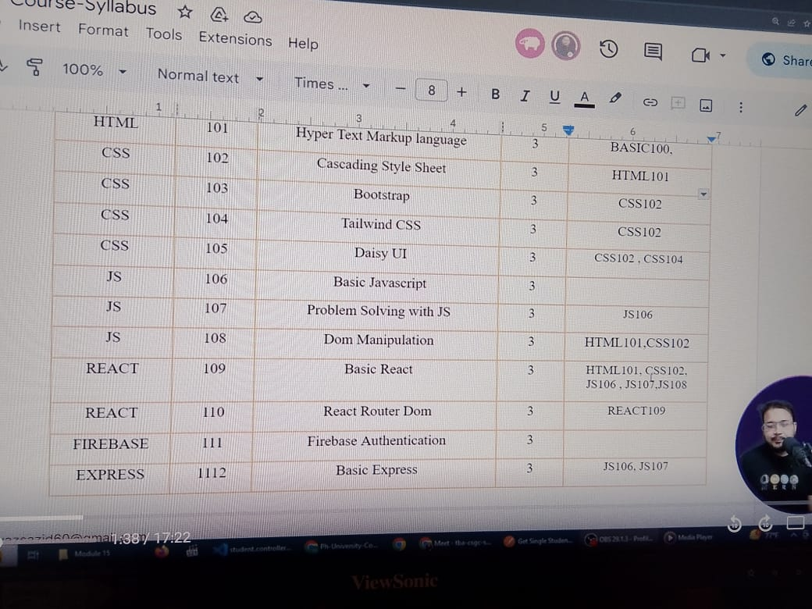
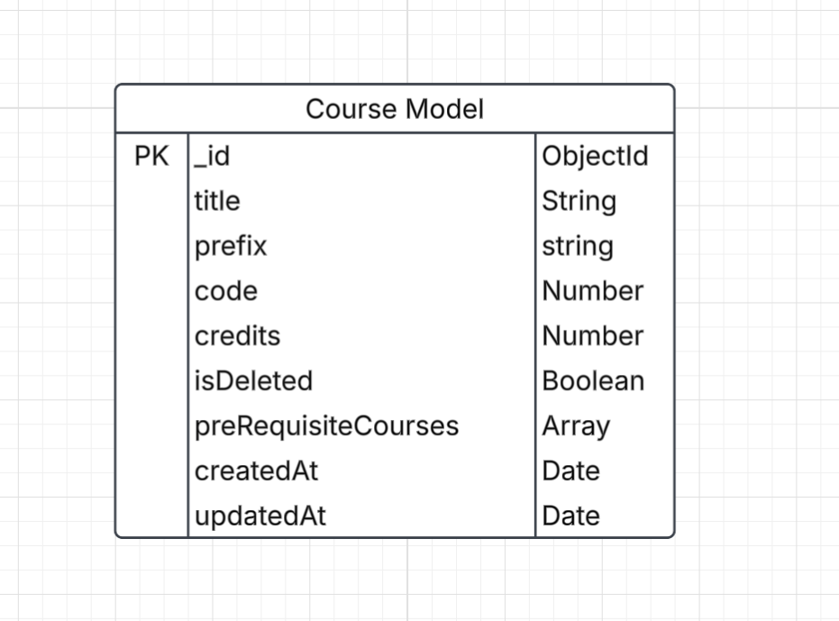
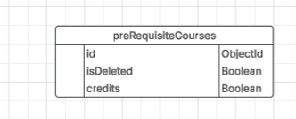
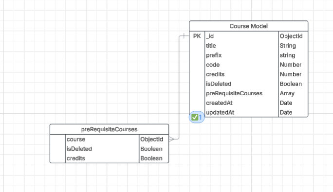

# University Management System Part-5

### What We Will Learn Here?

1. Course and PreRequisiteCourse
2. Dynamically Update Course with PreRequisite Course
3. Faculty With Course Relation
4. Semester Registration
5. Business Logic Validation


- FindOne will be used for others fields
- FindById will be used when mongoose id used to find
  
- Where There is mongodb Id We will use mongoose id.
- Using Both is right but using same pattern in entire project is required

## 15-2 Create Course Interface and Model




- We have Kept Model so that we can keep array array of Object and object. or we can keep nested type inside the preRequisiteCourses
  
- We will keep embedding courses fields inside array. but inside the array the data will be referencing data. That means inside a preRequisiteCourse there will be data of the referenced courses data. These are called sub-schema or embedding fields



- For This No Collection Will be created
- Here Id Will be referenced to the course Id since preRequisiteCourse is itself a course
- One Course Might Have many preRequisiteCourses



- id is renamed as Course

### Time To Code

- course.interface.ts

```ts
import { Types } from 'mongoose';

<!-- sub interface  -->
export type TPreRequisiteCourses = {
  course: Types.ObjectId;
  isDeleted: boolean;
};
export type TCourses = {
  title: string;
  prefix: string;
  code: number;
  credits: number;
  preRequisiteCourses: [];
};

```

- course.model.ts

```ts
import { model, Schema } from 'mongoose';
import { TCourses, TPreRequisiteCourses } from './course.interface';

// This is a sub Schema
const preRequisiteCourses = new Schema<TPreRequisiteCourses>({
  course: {
    type: Schema.Types.ObjectId,
  },
  isDeleted: {
    type: Boolean,
    default: false,
  },
});
const courseSchema = new Schema<TCourses>({
  title: {
    type: String,
    unique: true,
    trim: true,
    required: true,
  },
  prefix: {
    type: String,
    trim: true,
    required: true,
  },
  code: {
    type: Number,
    trim: true,
    required: true,
  },
  credits: {
    type: Number,
    trim: true,
    required: true,
  },
  preRequisiteCourses: [preRequisiteCourses],
  // array of the preRequisite Courses
});

export const Course = model<TCourses>('Course', courseSchema);
```
