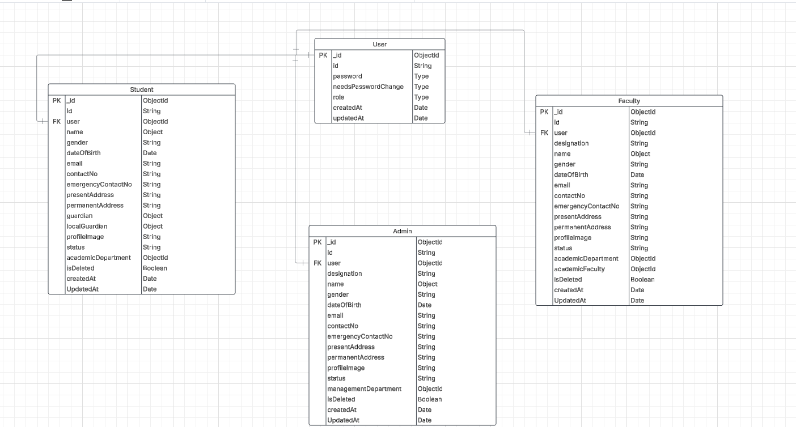

# University management System Module-11

GitHub Link: https://github.com/Apollo-Level2-Web-Dev/Level2-Batch4-PH-University-Server/tree/part-1

Requirement Analysis: https://docs.google.com/document/d/10mkjS8boCQzW4xpsESyzwCCLJcM3hvLghyD_TeXPBx0/edit?usp=sharing

In this module,

We start by learning about the Software Development Life Cycle (SDLC) and how to initiate a project. We analyze the requirements for a university management system and model the necessary data. We'll design a database schema and create Entity-Relationship (ER) diagrams to organize data. Then, we'll set up API endpoints, build user interfaces, and implement data validation. The course also covers refining code for user validation, routes, controllers, and services. We'll create student user accounts, fix bugs, and set up a global error handler. Additionally, we develop a "not found" route and a response utility, and we wrap up by creating an index route and summarizing the modules. This ensures you gain practical skills for building web applications.

## 11-1 What is SDLC? How we Should start a Project

- This Project will be MVP


## 11-2 Requirement Analysis of PH University Management## 11-1 What is SDLC, How we should start a project

- This Project will be based on MVP

#### What is SDLC?

- The Software Development Life Cycle (SDLC) is a systematic process for planning, creating, testing, and deploying software applications. It provides a structured framework that helps software developers and organizations deliver high-quality software that meets customer expectations while adhering to time and cost constraints.

#### PLANNING->ANALYZE->DESIGN->IMPLEMENTATION->TESTING & INTEGRATION->MAINTENANCE

- Analyze : Product Owner, Project Manager, Business Analyst
- Design: System Architect, UI/UX Designer
- Development: Frontend, Backend , Fullstack Developer
- Testing : Solution Architect, QA Engineer, Tester
- Deployment : Database Administration, DevOPS
- Maintenance : Support Engineer, Tester, Developer

#### Requirements Steps

- Analyze : Product Requirements Document(PRD), Business Requirements Document(BDR), Software Requirement Specification(SRS), Functional Requirement Document(FRD)
- Design: System Design Of Software, High Level Design Document, Low Level Design Document, Database Schema
- Development: Frontend, Backend , API Integration, Database Schema
- Testing : Test Plan, Test Case, Test Scripts, Defects Report
- Deployment : Release Notes, Installation Guide, Configuration Guide
- Maintenance : Change Request, Bug Report, Patch Release

#### How we will work ?

- Requirement Analysis -> ER Diagram ->API Endpoint -> WireFrame

### 11-2 Requirement Analysis of PH University Management

PH University Management Project

Functional Requirements:

_Authentication_
**Student:**

- Students can log in and log out securely.
- Students can update their password.

**Faculty:**

- Faculty can log in and log out securely.
- Faculty can update their password.

**Admin:**

- Admin can log in and log out securely.
- Admin can update their password.

_Profile Management:_
**Student:**

- Students can manage and update their profile.
- Students can update certain fields.

**Faculty:**

- Faculty can manage and update their profile.
- Faculty can update certain fields.

**Admin:**

- Admin can manage and update their profile.
- Admin can update certain fields.

_Academic Process:_
**Student:**

- Students can enroll in offered courses for a specific semester.
- Students can view their class schedule.
- Students can see their grades.
- Students can view notice boards and events.

**Faculty:**

- Faculty can manage student grades.
- Faculty can access student’s personal and academic information.

**Admin:**

- Admin can manage multiple processes:
  - Semester.
  - Course.
  - Offered Course.
  - Section.
  - Room.
  - Building.

_User Management:_
**Admin:**

- Admins can manage multiple accounts.
- Admin can block/unblock users.
- Admin can change user passwords.

### 11-3 Modeling Data for PH University Management

_Data Model:_

**User:**

- \_id
- id (generated)
- password
- needsPasswordChange
- role
- status
- isDeleted
- createdAt
- updatedAt

**Student:**

- \_id
- id (generated)
- name
- gender
- dateOfBirth
- email
- contactNo
- emergencyContactNo
- presentAddress
- permanentAddress
- guardian
- localGuardian
- profileImage
- admissionSemester
- isDeleted
- createdAt
- updatedAt

**Faculty:**

- \_id
- id (generated)
- designation
- name
- gender
- dateOfBirth
- email
- contactNo
- emergencyContactNo
- presentAddress
- permanentAddress
- profileImage
- academicFaculty
- academicDepartment
- isDeleted
- createdAt
- updatedAt

**Admin:**

- \_id
- id (generated)
- designation
- name
- gender
- dateOfBirth
- email
- contactNo
- emergencyContactNo
- presentAddress
- permanentAddress
- profileImage
- managementDepartment
- isDeleted
- createdAt
- updatedAt

**Academic Semester:**

- \_id
- name
- year
- code
- startMonth
- endMonth
- createdAt
- updatedAt

**Academic Faculty:**

- \_id
- name
- createdAt
- updatedAt

**Academic Department:**

- \_id
- name
- academicFaculty
- createdAt
- updatedAt

### 11-4 Design Schema and ER Diagram

- SQL Table is called Collection In NoSQL
- SQL Row is called Document In NoSQL
- SQL Column is called Field In NoSQL

#### We can Do Embedding Or Referencing In NoSQL.

- We can do embedding Up to max 16MB since a document can be only 16 mb
- In Referencing There is no Limitation

##### So where there i a chance of growing data we should use referencing

##### Embedding Pros and cons

| **Pros**                            | **Cons**                    |
| ----------------------------------- | --------------------------- |
| Faster Reading                      | Slow Writing                |
| Update all data with a single query | Update query can be complex |
| Less expensive lookup               | Limited size                |
|                                     | Data duplicacy              |

##### Referencing Pros and cons

| **Pros**        | **Cons**              |
| --------------- | --------------------- |
| Faster Writing  | Slow Reading          |
| Avoid Duplicacy | Slow Expensive Lookup |
| Scalability     |                       |



## 11-6 Create API Endpoints for PH University Management

### API Endpoints

#### User:

- users/create-student (POST)
- users/create-faculty (POST)
- users/create-admin (POST)

#### Student:

- students (GET)
- students/:id (GET)
- students/:id (PATCH)
- students/:id (DELETE)
- students/my-profile

#### Faculty:

- faculties(GET)
- faculties/:id (GET)
- faculties/:id (PATCH)
- faculties/:id (DELETE)
- faculties/my-profile

#### Admin:

- admins (GET)
- admins /:id (GET)
- admins /:id (PATCH)
- admins /:id (DELETE)
- admins /my-profile

#### Auth:

- auth/login
- auth/refresh-token
- auth/change-password
- auth/forgot-password
- auth/reset-password


## 11-7 Create user interface ,model and validation

- see code

## 11-8 Refactor user validation , student route ,controller and service

What is z.infer<>?
z.infer<> is a TypeScript utility provided by Zod that infers the TypeScript type from a Zod schema.

2️⃣ What is typeof User?
User is assumed to be a Zod schema.
typeof User refers to the actual schema definition, not an instance of it.

- we will fist create validation and the we will create automatic t5ype generation using z.infer using the validation
- We will not always send property form client, sometimes properties will be created in server automatically.
- If we can make the validation schema and the interface aligned we will be able to use infer.
  
- The id will be generated automatically it will not come from client
- password will be auto generated or admin can set the pass manually
  
- The Role will also be handled by server i mean when the right api is hit the right role will ber fixed by server
- as some fields are eliminated we will not use infer. we will use raw

```ts
import { z } from 'zod';

const User = z.object({
  username: z.string(),
});

User.parse({ username: 'Ludwig' });

// extract the inferred type
type User = z.infer<typeof User>;
// { username: string }
```

- z.infer<T> is a utility provided by Zod to extract the TypeScript type from a Zod schema.
- Instead of writing the type manually, you let Zod infer (deduce) it from the schema.

- first we will create validation and inferring the validation we can create type automatically
- But It will not work all the time since we will not send everything from client. some property will be made by server automatically.
- so, **If the validation schema is aligned with the interface we will only then we will use infer**

- Its like id will be generated by server, password will be optional, either it will be default set or we can set by our own, role will be automatically set by server when exact route will be hit. for this mixed functionalities we will not use infer. we will use raw zod.

- Commented validations will be done by server or the default value is there which will be set by server as well. so in zod those are not required.

```ts
// user.validation.ts
import { z } from 'zod';

const userValidationSchema = z.object({
  password: z
    .string({
      required_error: 'Password must be string',
      invalid_type_error: 'Name must be a string',
    })
    .max(20, { message: 'Password can not be more than 20 characters' })
    .optional(),
  //   needsPasswordChange: z.boolean().optional().default(true),
  //   role: z.enum(['student', 'admin', 'faculty']),
  //   status: z.enum(['in-progress', 'blocked']).default('in-progress'),
  //   isDeleted: z.boolean().optional().default(false),
  // these will be done by server or the default value is there which will be set by server as well. so in zod those are not required.
});

export const UserValidation = {
  userValidationSchema,
};
```

- All account creation works will be done user model

## 11-9 Refactor user controller and service


- we will first create user and then we will take the user \_id and put in the student,admin or faculty data. that means referencing. as \_id is object id so it can refer.

- The Id that we are adding as student id, faculty id of admin id that will be auto generated by server. The Id will be embedded in the end user.

## 11-10 Create User as Student

- To Grab the mongodb \_id in interface we have to use Types.ObjectId. Types should come from Mongoose

```ts
user: Types.ObjectId;
```

- To Grab the mongodb \_id in model we have to use type: Schema.Types.ObjectId, Schema should come from mongoose.

```ts
type: Schema.Types.ObjectId,
```

- To do referencing we have to use ref

```ts
    user: {
      type: Schema.Types.ObjectId,
      required: [true, 'User Is Required'],
      unique: true,
      ref: 'User', //This is the model name what we want to refer
    },
```

## 11-11 Fix bugs and setup basic global error handler

- if we use next(err) it will take as error in express and sends to global error handler

```ts
try {
  const result = await StudentServices.getAllStudentsFromDB();
  // send response
  res.status(200).json({
    success: true,
    message: 'Students are retrieved successfully',
    data: result,
  });
} catch (err) {
  // res.status(500).json({
  //   success: false,
  //   message: err.message || 'Something went wrong',
  //   error: err,
  // });
  next(err);
}
```

- global error handler

```ts
// app.ts
// global error handler
// @ts-ignore
app.use((err: any, req: Request, res: Response, next: NextFunction) => {
  const statusCode = 500;
  const message = err.message || 'Something Went Wrong';

  return res.status(statusCode).json({
    success: false,
    message,
    error: err,
  });
});
```

- Must ignore the errors since ts can not define here

- we can use global error handler in middleware

```ts
// globalErrorHandler.ts
/* eslint-disable no-unused-vars */
/* eslint-disable @typescript-eslint/no-unused-vars */
/* eslint-disable @typescript-eslint/no-explicit-any */

import { NextFunction, Request, Response } from 'express';

// global error handler
const globalErrorHandler = (
  err: any,
  req: Request,
  res: Response,
  next: NextFunction,
) => {
  const statusCode = 500;
  const message = err.message || 'Something Went Wrong';

  return res.status(statusCode).json({
    success: false,
    message,
    error: err,
  });
};

export default globalErrorHandler;
```

```ts
// app.ts
/* eslint-disable @typescript-eslint/ban-ts-comment */
import express, { Application, Request, Response } from 'express';
import cors from 'cors';
import { StudentRoutes } from './app/modules/students/student.route';
import { userRoutes } from './app/modules/user/user.route';
import globalErrorHandler from './app/middlewares/globalErrorHandler';

const app: Application = express();

// Parser
app.use(express.json());
app.use(cors());

// application routes
app.use('/api/v1/students', StudentRoutes);
app.use('/api/v1/users', userRoutes);

app.get('/', (req: Request, res: Response) => {
  const a = 10;
  res.send(a);
});

// using global error handler
// @ts-ignore
app.use(globalErrorHandler);
app.use(notFound);

export default app;
```

## 11-12 Create not found route & sendResponse utility


- For Handling error status code we can use this npm
  [STATUS-CODE-HANDLING NPM](https://www.npmjs.com/package/http-status)
- using this npm

```ts
/* eslint-disable no-unused-vars */
/* eslint-disable @typescript-eslint/no-unused-vars */
/* eslint-disable @typescript-eslint/no-explicit-any */

import { NextFunction, Request, Response } from 'express';

// global error handler
const globalErrorHandler = (
  err: any,
  req: Request,
  res: Response,
  next: NextFunction,
) => {
  const statusCode = 500;
  const message = err.message || 'Something Went Wrong';

  return res.status(statusCode).json({
    success: false,
    message,
    error: err,
  });
};

export default globalErrorHandler;
```

- we can deal with not found route

```ts
// notFound.ts
/* eslint-disable no-unused-vars */
/* eslint-disable @typescript-eslint/no-unused-vars */

import { NextFunction, Request, Response } from 'express';
import httpStatus from 'http-status';

const notFound = (req: Request, res: Response, next: NextFunction) => {
  return res.status(httpStatus.NOT_FOUND).json({
    success: false,
    message: 'API NOT FOUND',
    error: '',
  });
};

export default notFound;
```

- we can deal with success message as well

```ts
import { Response } from 'express';

type TResponse<T> = {
  statusCode: number;
  success: boolean;
  message?: string;
  data: T;
};
const sendResponse = <T>(res: Response, data: TResponse<T>) => {
  res.status(data?.statusCode).json({
    success: data.success,
    message: data.message,
    data: data.data,
  });
};

export default sendResponse;
```
