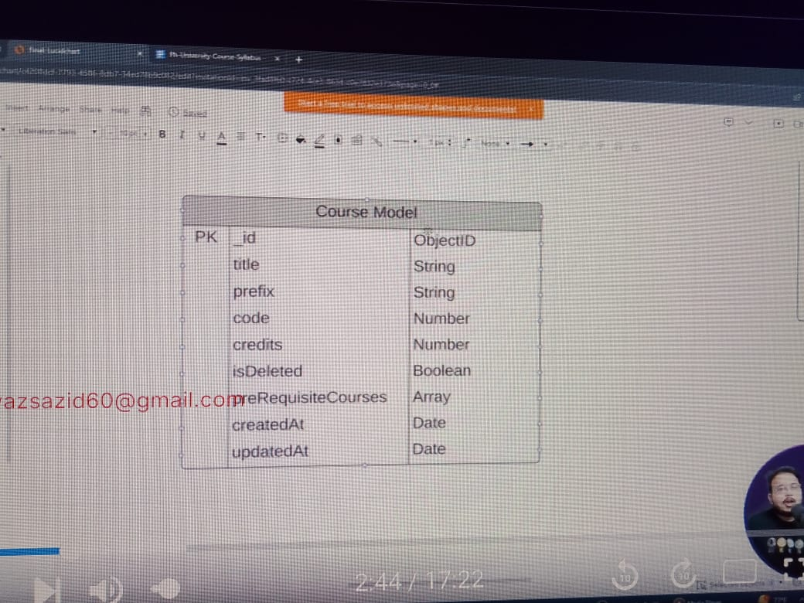

# University Management System Part -4

GitHub Link:

https://github.com/Apollo-Level2-Web-Dev/Level2-Batch4-PH-University-Server/tree/part-4

### What we Will learn In This Module

- Error Handling
- Searching
- Filtering
- Pagination

## 14-1 What Is Error Handling


This is The Error Handling We Are doing but as a developer we have to do error handling more precisely since we do not want application to be stopped by any error

### Types Of Errors

#### Operational Error (We can Handle it in express application)

- Errors that we can predict will happen in future
  1. Invalid User Input
  2. Failed to run server
  3. Failed to connect database
  4. Invalid auth token

#### Programmatic Error (We can Handle it in express application)

- Errors that developers produces when developing

  1. using undefined variables
  2. using properties that do not exist
  3. passing number instead of string
  4. using req.params instead of req.query

- Operational and Programmatic Error wll happen inside the application so these can be handles inside express application

#### Unhandled Rejection(Asynchronous code)

- When we Resolve Promise, sometimes some promises might be rejected, this is called unhandled rejection if we do not handled
- This can be inside or outside the express application

#### Uncaught Expectation (synchronous Code)

- This can be inside or outside the express application

## Know More About Errors


- Operational and Programmatic Error wll happen inside the application so these can be handles inside express application
- Unhandled Rejection(Asynchronous code),Unhandled Rejection(Asynchronous code) be inside or outside the express application
- Errors Can Come From Nay File
  

- There Might Be different types of pattern of different errors, like zos
- ZodError
  
- Mongoose Validation Error
  
- Mongoose Cast Error
  
- Mongoose Duplicate Error
  

#### We can not send multiple pattern to frontend and this is not right


### We will handle all the errors using global Error Handler then we will make different error handler and make common pattern and send to frontend


- The Error Pattern Will be like this
  
  
- We will not send the stack in production
  

## 14-2 Understanding Error Patterns in Zod and Mongoose

- we have to take care of all layer error handling even if we have handled in different layer
- we need consistence pattern of error

<!--
success:
message:
errorSources:[
path:'',
message:''
]
stack:''
 -->

- we can use ErrorRequestHandler

```ts
const globalErrorHandler = (
  err: any,
  req: Request,
  res: Response,
  next: NextFunction,
) => {};
```

- updated

```ts
const globalErrorHandler: ErrorRequestHandler = (err, req, res, next) => {};
```

## 14-3 How to Convert Zod Error

- Zod Error Pattern

```ts
 "err": {
        "issues": [
            {
                "code": "invalid_type",
                "expected": "string",
                "received": "undefined",
                "path": [
                    "body",
                    "name"
                ],
                "message": "Name Is Required"
            }
        ],
        "name": "ZodError"
    },
```

- First We Will Detect The Error and then using the handler we will modify the error according to us

[ZOD ERROR HANDLING](https://zod.dev/ERROR_HANDLINGhttps://zod.dev/ERROR_HANDLING)

- First we have to trace in which structure our error is coming and then we will organize our error handler based on that


- Zod provides a subclass of Error called ZodError. ZodErrors contain an issues array containing detailed information about the validation problems.

- ZodError is a subclass of Error; you can create your own instance easily:
- To checking class, subclass or instance we have to use instanceof operator
- Handling Zod Error

```ts
/* eslint-disable no-unused-vars */
/* eslint-disable @typescript-eslint/no-unused-vars */
import { ErrorRequestHandler } from 'express';
import { ZodError, ZodIssue } from 'zod';
import { TErrorSource } from '../interface/error';

const globalErrorHandler: ErrorRequestHandler = (err, req, res, next) => {
  let statusCode = err.statusCode || 500;
  let message = err.message || 'Something Went Wrong';

  type TErrorSource = {
    path: string | number;
    message: string;
  }[];

  let errorSource: TErrorSource = [
    {
      path: '',
      message: 'Something Went Wrong',
    },
  ];

  // zod error handler
  const handleZodError = (err: ZodError) => {
    // handler organize the errors structure

    // making error source since we are not sending the zod error directly
    // we ar doing map since multiple issue can come
    const errorSources: TErrorSource = err.issues.map((issue: ZodIssue) => {
      return {
        path: issue?.path[issue.path.length - 1],
        //we are doing this since last index of path object shows the exact path
        message: issue.message,
      };
    });
    return {
      statusCode,
      message: 'Zod Validation Error',
      errorSource,
    };
  };
  // To checking class, subclass or instance we have to use instanceof operator
  //  we are detecting here that this is a zod error
  if (err instanceof ZodError) {
    // now we will send the error to the handler
    const simplifiedError = handleZodError(err);
    // console.log(simplifiedError);
    //  now we will be doing over write
    statusCode = simplifiedError?.statusCode;
    message = simplifiedError?.message;
    errorSource = simplifiedError?.errorSource;
  }

  res.status(statusCode).json({
    success: false,
    message,
    errorSource,
    stack: config.NODE_ENV === 'development' ? err?.stack : null,
  });
};

export default globalErrorHandler;
```

## 14-4 How To Convert Mongoose Validation Error

- Mongoose is The First validation layer and on top of mongoose Zod Validation is standing
- a Fewer error will go to mongoose because zod error will handle but still we have to handle

- Mongoose Error Pattern

```ts
   "err": {
        "errors": {
            "name": {
                "name": "ValidatorError",
                "message": "Path `name` is required.",
                "properties": {
                    "message": "Path `name` is required.",
                    "type": "required",
                    "path": "name"
                },
                "kind": "required",
                "path": "name"
            }
        },
        "_message": "AcademicDepartment validation failed",
        "name": "ValidationError",
        "message": "AcademicDepartment validation failed: name: Path `name` is required."
    },
```

- We Have to Manipulate this

- "name": "ValidationError", This will be used to detect the Mongoose Error. and we can access this by using err.name

- Mongoose Error Handler

```ts
import mongoose from 'mongoose';
import { TErrorSources } from '../interface/error';

const handleValidationError = (err: mongoose.Error.ValidationError) => {
  const errorSource: TErrorSources = Object.values(err.errors).map(
    (val: mongoose.Error.ValidatorError | mongoose.Error.CastError) => {
      return {
        path: val?.path,
        message: val?.message,
      };
    },
  );

  const statusCode = 400;
  return {
    statusCode,
    message: 'Mongoose Validation Error',
    errorSource,
  };
};

export default handleValidationError;
```

- Final Global Error Handler

```ts
/* eslint-disable no-unused-vars */
/* eslint-disable @typescript-eslint/no-unused-vars */
import { ErrorRequestHandler } from 'express';
import { ZodError, ZodIssue } from 'zod';
import { TErrorSources } from '../interface/error';
import config from '../config';
import handleZodError from '../errors/handleZodError';
import handleValidationError from '../errors/handleValidationError';

const globalErrorHandler: ErrorRequestHandler = (err, req, res, next) => {
  let statusCode = err.statusCode || 500;
  let message = err.message || 'Something Went Wrong';

  let errorSource: TErrorSources = [
    {
      path: '',
      message: 'Something Went Wrong',
    },
  ];

  // To checking class, subclass or instance we have to use instanceof operator
  //  we are detecting here that this is a zod error
  if (err instanceof ZodError) {
    // now we will send the error to the handler
    const simplifiedError = handleZodError(err);
    // console.log(simplifiedError);
    //  now we will be doing over write
    statusCode = simplifiedError?.statusCode;
    message = simplifiedError?.message;
    errorSource = simplifiedError?.errorSource;
  } else if (err?.name === 'ValidationError') {
    // console.log('Ami Mongoose Validation Error');
    const simplifiedError = handleValidationError(err);
    statusCode = simplifiedError?.statusCode;
    message = simplifiedError?.message;
    errorSource = simplifiedError?.errorSource;
  }

  res.status(statusCode).json({
    success: false,
    message,
    errorSource,
    stack: config.NODE_ENV === 'development' ? err?.stack : null,
  });
};

export default globalErrorHandler;
```

## 14-5 How To Handle Cast Error And 11000 Error

- we should create a return type as well so that fixed type data is sent

```ts
import mongoose from 'mongoose';
import { TErrorSources } from '../interface/error';
type TGenericErrorResponse = {
  statusCode: number;
  message: string;
  errorSource: TErrorSources;
};

const handleValidationError = (
  err: mongoose.Error.ValidationError,
): TGenericErrorResponse => {
  const errorSource: TErrorSources = Object.values(err.errors).map(
    (val: mongoose.Error.ValidatorError | mongoose.Error.CastError) => {
      return {
        path: val?.path,
        message: val?.message,
      };
    },
  );

  const statusCode = 400;
  return {
    statusCode,
    message: 'Mongoose Validation Error',
    errorSource,
  };
};

export default handleValidationError;
```

- Cast Error means {{ph-local-url}}/academic-departments/67de60ac07446b2c38bf6bc3 in here when id is invalid it shows a cast error.
- Cast Error Pattern

```ts
"err": {
        "stringValue": "\"67de60ac07446b2c38bf6bcewe\"",
        "valueType": "string",
        "kind": "ObjectId",
        "value": "67de60ac07446b2c38bf6bcewe",
        "path": "_id",
        "reason": {},
        "name": "CastError",
        "message": "Cast to ObjectId failed for value \"67de60ac07446b2c38bf6bcewe\" (type string) at path \"_id\" for model \"AcademicDepartment\""
    },
```

- Handling Cast Error

```ts
import mongoose from 'mongoose';
import { TErrorSources, TGenericErrorResponse } from '../interface/error';

const handleCastError = (
  err: mongoose.Error.CastError,
): TGenericErrorResponse => {
  const errorSource: TErrorSources = [
    {
      path: err.path,
      message: err.message,
    },
  ];
  const statusCode = 400;
  return {
    statusCode,
    message: 'Invalid Id',
    errorSource,
  };
};

export default handleCastError;
```

- Global Error Handler Changes

```ts
/* eslint-disable no-unused-vars */
/* eslint-disable @typescript-eslint/no-unused-vars */
import { ErrorRequestHandler } from 'express';
import { ZodError, ZodIssue } from 'zod';
import { TErrorSources } from '../interface/error';
import config from '../config';
import handleZodError from '../errors/handleZodError';
import handleValidationError from '../errors/handleValidationError';
import handleCastError from '../errors/handleCastError';

const globalErrorHandler: ErrorRequestHandler = (err, req, res, next) => {
  let statusCode = err.statusCode || 500;
  let message = err.message || 'Something Went Wrong';

  let errorSource: TErrorSources = [
    {
      path: '',
      message: 'Something Went Wrong',
    },
  ];

  // To checking class, subclass or instance we have to use instanceof operator
  //  we are detecting here that this is a zod error
  if (err instanceof ZodError) {
    // now we will send the error to the handler
    const simplifiedError = handleZodError(err);
    // console.log(simplifiedError);
    //  now we will be doing over write
    statusCode = simplifiedError?.statusCode;
    message = simplifiedError?.message;
    errorSource = simplifiedError?.errorSource;
  } else if (err?.name === 'ValidationError') {
    // console.log('Ami Mongoose Validation Error');
    const simplifiedError = handleValidationError(err);
    statusCode = simplifiedError?.statusCode;
    message = simplifiedError?.message;
    errorSource = simplifiedError?.errorSource;
  } else if (err?.name === 'CastError') {
    const simplifiedError = handleCastError(err);
    statusCode = simplifiedError?.statusCode;
    message = simplifiedError?.message;
    errorSource = simplifiedError?.errorSource;
  }

  res.status(statusCode).json({
    success: false,
    message,
    errorSource,
    // err,
    stack: config.NODE_ENV === 'development' ? err?.stack : null,
  });
};

export default globalErrorHandler;
```

- We have to handled the duplicate id error, though we have used pre hook to handle the duplicate id, we have to handle the 11000 error for this
- If we have not handled using pre hook it would be handled by using unique:true, technically unique:true is not a validator, unique just does indexing and sends error

- Duplicate Error Format

```ts
"err": {
        "errorLabelSet": {},
        "errorResponse": {
            "index": 0,
            "code": 11000,
            "errmsg": "E11000 duplicate key error collection: first-project.academicdepartments index: name_1 dup key: { name: \"Department Of Computer Science and Engineering\" }",
            "keyPattern": {
                "name": 1
            },
            "keyValue": {
                "name": "Department Of Computer Science and Engineering"
            }
        },
        "index": 0,
        "code": 11000,
        "keyPattern": {
            "name": 1
        },
        "keyValue": {
            "name": "Department Of Computer Science and Engineering"
        }
    },
```

- we can handle Duplicate Error

```ts
import { TErrorSources, TGenericErrorResponse } from '../interface/error';

const handleDuplicateError = (err: any): TGenericErrorResponse => {
  const match = err.message.match(/"([^"]*)"/);
  const extractedMessage = match && match[1];
  const errorSource: TErrorSources = [
    {
      path: '',
      message: extractedMessage,
    },
  ];
  const statusCode = 400;
  return {
    statusCode,
    message: `${extractedMessage} Already Exist`,
    errorSource,
  };
};

export default handleDuplicateError;
```

- Final Global Error Handler

```ts
/* eslint-disable no-unused-vars */
/* eslint-disable @typescript-eslint/no-unused-vars */
import { ErrorRequestHandler } from 'express';
import { ZodError, ZodIssue } from 'zod';
import { TErrorSources } from '../interface/error';
import config from '../config';
import handleZodError from '../errors/handleZodError';
import handleValidationError from '../errors/handleValidationError';
import handleCastError from '../errors/handleCastError';
import handleDuplicateError from '../errors/handleDuplicateError';

const globalErrorHandler: ErrorRequestHandler = (err, req, res, next) => {
  let statusCode = err.statusCode || 500;
  let message = err.message || 'Something Went Wrong';

  let errorSource: TErrorSources = [
    {
      path: '',
      message: 'Something Went Wrong',
    },
  ];

  // To checking class, subclass or instance we have to use instanceof operator
  //  we are detecting here that this is a zod error
  if (err instanceof ZodError) {
    // now we will send the error to the handler
    const simplifiedError = handleZodError(err);
    // console.log(simplifiedError);
    //  now we will be doing over write
    statusCode = simplifiedError?.statusCode;
    message = simplifiedError?.message;
    errorSource = simplifiedError?.errorSource;
  } else if (err?.name === 'ValidationError') {
    // console.log('Ami Mongoose Validation Error');
    const simplifiedError = handleValidationError(err);
    statusCode = simplifiedError?.statusCode;
    message = simplifiedError?.message;
    errorSource = simplifiedError?.errorSource;
  } else if (err?.name === 'CastError') {
    const simplifiedError = handleCastError(err);
    statusCode = simplifiedError?.statusCode;
    message = simplifiedError?.message;
    errorSource = simplifiedError?.errorSource;
  } else if (err?.code === 11000) {
    const simplifiedError = handleDuplicateError(err);
    statusCode = simplifiedError?.statusCode;
    message = simplifiedError?.message;
    errorSource = simplifiedError?.errorSource;
    // console.log('Ami Duplicate');
  }

  res.status(statusCode).json({
    success: false,
    message,
    errorSource,
    // err,
    stack: config.NODE_ENV === 'development' ? err?.stack : null,
  });
};

export default globalErrorHandler;
```

## 14-6 How To Handle Error, AppError, unhandledRejection, uncaughtRejection

- we have used throw new error and throw AppError in several places in this project, we want to make it more optimized since we are sending error response in our own format
- As throw new Error or throw new AppError is class so we will use instance of operator to check the error
- Global Error handler updated

```ts
/* eslint-disable no-unused-vars */
/* eslint-disable @typescript-eslint/no-unused-vars */
import { ErrorRequestHandler } from 'express';
import { ZodError, ZodIssue } from 'zod';
import { TErrorSources } from '../interface/error';
import config from '../config';
import handleZodError from '../errors/handleZodError';
import handleValidationError from '../errors/handleValidationError';
import handleCastError from '../errors/handleCastError';
import handleDuplicateError from '../errors/handleDuplicateError';
import AppError from '../errors/AppError';

const globalErrorHandler: ErrorRequestHandler = (err, req, res, next) => {
  let statusCode = 500;
  let message = 'Something Went Wrong';

  let errorSource: TErrorSources = [
    {
      path: '',
      message: 'Something Went Wrong',
    },
  ];

  // To checking class, subclass or instance we have to use instanceof operator
  //  we are detecting here that this is a zod error
  if (err instanceof ZodError) {
    // now we will send the error to the handler
    const simplifiedError = handleZodError(err);
    // console.log(simplifiedError);
    //  now we will be doing over write
    statusCode = simplifiedError?.statusCode;
    message = simplifiedError?.message;
    errorSource = simplifiedError?.errorSource;
  } else if (err?.name === 'ValidationError') {
    // console.log('Ami Mongoose Validation Error');
    const simplifiedError = handleValidationError(err);
    statusCode = simplifiedError?.statusCode;
    message = simplifiedError?.message;
    errorSource = simplifiedError?.errorSource;
  } else if (err?.name === 'CastError') {
    const simplifiedError = handleCastError(err);
    statusCode = simplifiedError?.statusCode;
    message = simplifiedError?.message;
    errorSource = simplifiedError?.errorSource;
  } else if (err?.code === 11000) {
    const simplifiedError = handleDuplicateError(err);
    statusCode = simplifiedError?.statusCode;
    message = simplifiedError?.message;
    errorSource = simplifiedError?.errorSource;
    // console.log('Ami Duplicate');
  } else if (err instanceof AppError) {
    statusCode = err?.statusCode;
    message = err?.message;
    errorSource = [
      {
        path: '',
        message: err?.message,
      },
    ];
  } else if (err instanceof Error) {
    //  status code will be coming from the default value
    message = err?.message;
    errorSource = [
      {
        path: '',
        message: err?.message,
      },
    ];
  }

  res.status(statusCode).json({
    success: false,
    message,
    errorSource,
    // err,
    stack: config.NODE_ENV === 'development' ? err?.stack : null,
  });
};

export default globalErrorHandler;
```

### Now comes the unhandled Rejection and uncaught rejection

- Node js is a process
- The process will automatically turns off and sometimes we have to off this throwing Error. we can not run server keeping error


- To stop the process we have to use process.exit(1) here 1 means true
- in synchronous code if we get unCaughtException we will stop the process immediately
- In asynchronous code if unhandledRejection happens we will handle it more politely like we are closing all things and then shuts down.
  
- will handle it politely since many process will be running and they should be closed then we should stop the process

```ts
server.close(() => {
  process.exit(1);
});
```

- we will not do these in globalErrorHandler since it just handles error of express application
- Unhandled rejection or Uncaught exception will be coming from all over application process, for this reason we will assign the server in a variable so that we can detect
- Since node.js is a event driven architecture, we will listen in the process for uncaughtException and unhandledRejection so that we detect and handle

### UnhandledRejection implementation in case of asynchronous code

- app.ts

```ts
/* eslint-disable @typescript-eslint/ban-ts-comment */
import express, { Application, Request, Response } from 'express';
import cors from 'cors';

import globalErrorHandler from './app/middlewares/globalErrorHandler';
import notFound from './app/middlewares/notFound';
import router from './app/routes';
const app: Application = express();

// parser
app.use(express.json());
app.use(cors());

// application Routes
app.use('/api/v1/', router);

// understanding unhandledRejection
const test = async (req: Request, res: Response) => {
  // res.send('Connected');
  Promise.reject();
};

app.get('/', test);

app.use(globalErrorHandler);

// not found route
// @ts-expect-error
app.use(notFound);
export default app;
```

- server.ts

```ts
import mongoose from 'mongoose';
import config from './app/config';
import app from './app';
import { Server } from 'http';

let server: Server;
//  we have to bring the type from http since we use http to make raw node.js server
async function main() {
  try {
    await mongoose.connect(config.database_url as string);
    server = app.listen(config.port, () => {
      console.log(`Example app listening on port ${config.port}`);
    });
  } catch (error) {
    console.log(error);
  }
}

main();

// Since node.js is a event driven architecture, we will listen in the process for uncaughtException and unhandledRejection so that we detect(using process.on) and handle
process.on('unhandledRejection', () => {
  console.log(`UnhandledRejection Detected, shutting Down The Server`);
  if (server) {
    server.close(() => {
      process.exit(1);
    });
  }
  process.exit(1);
});
```

- in anywhere we are using Promise.reject(); it will be detected

### UncaughtException implementation in case of synchronous code

```ts
import mongoose from 'mongoose';
import config from './app/config';
import app from './app';
import { Server } from 'http';

let server: Server;
//  we have to bring the type from http since we use http to make raw node.js server
async function main() {
  try {
    await mongoose.connect(config.database_url as string);
    server = app.listen(config.port, () => {
      console.log(`Example app listening on port ${config.port}`);
    });
  } catch (error) {
    console.log(error);
  }
}

main();

// Since node.js is a event driven architecture, we will listen in the process for uncaughtException and unhandledRejection so that we detect(using process.on) and handle
process.on('unhandledRejection', () => {
  console.log(`UnhandledRejection Detected, shutting Down The Server`);
  if (server) {
    server.close(() => {
      process.exit(1);
    });
  }
  process.exit(1);
});

// uncaughtException

process.on('uncaughtException', () => {
  console.log(`uncaughtException Detected, shutting Down The Server`);
  process.exit(1);
});

console.log(x);
```

## 14-7 How to do raw Searching and filtering


- we send three types of data inside request

  1. Body - sending large data
  2. Prams - Sending Dynamic id or dynamic Field
  3. Query - the fields we need to query

- Query is a object made by express
  
- Inside searchTerm we do not tell specific field we do searching using the word and search in specific field and thi9s will be partial match
- Inside Filtering we will do exact match
  
- for search we will fix some fields
  
- For Filter we will give the value and the field at a time
- Params
  
- Method Chaining [each returns a query]
  

- student.controller.ts

```ts
const getAllStudents = catchAsync(async (req, res) => {
  console.log(req.query);
  const result = await StudentServices.getAllStudentsFromDB(req.query);
  sendResponse(res, {
    statusCode: status.OK,
    success: true,
    message: 'Student are retrieved Successfully',
    data: result,
  });
});
```

- student.service.ts

```ts
const getAllStudentsFromDB = async (query: Record<string, unknown>) => {
  // {email : {$regex: query.searchTerm,$options:i}}
  // {presentAddress : {$regex: query.searchTerm,$options:i}}
  // {'name.firstName' : {$regex: query.searchTerm,$options:i}}
  // These Fields will be dynamic should not be hardcoded since it could be any field. so we have to do mapping

  let searchTerm = '';
  if (query?.searchTerm) {
    searchTerm = query?.searchTerm as string;
  }
  const result = await Student.find({
    $or: ['email', 'name.firstName', 'presentAddress'].map((field) => ({
      [field]: { $regex: searchTerm, $options: 'i' },
    })),
  })
    .populate('admissionSemester')
    .populate({
      path: 'academicDepartment',
      populate: {
        path: 'academicFaculty',
      },
    });
  return result;
};
```

## 14-9 How to do pagination and field limiting

http://localhost:5000/api/v1/students?searchTerm=hasan&email=hasan.mahmud@example.com

- student.service.ts

```ts
const getAllStudentsFromDB = async (query: Record<string, unknown>) => {
  console.log('base Query', query);
  const queryObj = { ...query }; // we want to delete so we are making a copy so that i do not permanently deleted as we might need it in future
  // {email : {$regex: query.searchTerm,$options:i}}
  // {presentAddress : {$regex: query.searchTerm,$options:i}}
  // {'name.firstName' : {$regex: query.searchTerm,$options:i}}
  // These Fields will be dynamic should not be hardcoded since it could be any field. so we have to do mapping
  const studentSearchableFields = ['email', 'name.firstName', 'presentAddress'];
  let searchTerm = '';
  if (query?.searchTerm) {
    searchTerm = query?.searchTerm as string;
  }

  // Filtering
  const excludeFields = ['searchTerm'];
  // since searchTerm value is replaced and trying to do exact match in searchTerm. so we are excluding
  excludeFields.forEach((el) => delete queryObj[el]);
  console.log(query, queryObj);
  const searchQuery = Student.find({
    $or: studentSearchableFields.map((field) => ({
      [field]: { $regex: searchTerm, $options: 'i' },
    })),
  }); // we are not keeping await here since we will do chaining
  const result = await searchQuery
    .find(queryObj)
    .populate('admissionSemester')
    .populate({
      path: 'academicDepartment',
      populate: {
        path: 'academicFaculty',
      },
    });
  return result;
};
```

- Sorting & Limiting
  http://localhost:5000/api/v1/students?sort=email
  http://localhost:5000/api/v1/students?limit=1

```ts
const getAllStudentsFromDB = async (query: Record<string, unknown>) => {
  console.log('base Query', query);
  const queryObj = { ...query }; // we want to delete so we are making a copy so that i do not permanently deleted as we might need it in future
  // {email : {$regex: query.searchTerm,$options:i}}
  // {presentAddress : {$regex: query.searchTerm,$options:i}}
  // {'name.firstName' : {$regex: query.searchTerm,$options:i}}
  // These Fields will be dynamic should not be hardcoded since it could be any field. so we have to do mapping
  const studentSearchableFields = ['email', 'name.firstName', 'presentAddress'];
  let searchTerm = '';
  if (query?.searchTerm) {
    searchTerm = query?.searchTerm as string;
  }

  // Filtering
  const excludeFields = ['searchTerm', 'sort', 'limit'];
  // since searchTerm value is replaced and trying to do exact match in searchTerm. so we are excluding
  excludeFields.forEach((el) => delete queryObj[el]);
  console.log(query, queryObj);
  const searchQuery = Student.find({
    $or: studentSearchableFields.map((field) => ({
      [field]: { $regex: searchTerm, $options: 'i' },
    })),
  }); // we are not keeping await here since we will do chaining
  const filterQuery = searchQuery
    .find(queryObj)
    .populate('admissionSemester')
    .populate({
      path: 'academicDepartment',
      populate: {
        path: 'academicFaculty',
      },
    });

  let sort = '-createdAt';

  if (query.sort) {
    sort = query.sort as string;
  }

  const sortQuery = filterQuery.sort(sort);

  let limit = 1;

  if (query.limit) {
    limit = query.limit as number;
  }

  const limitQuery = sortQuery.sort(limit);
  return limitQuery;
};
```

## 14-9 How to do pagination and field limiting


- Limit is related to pagination
- We Will take the page and limit value from frontend
  
  
  
  
- Formula For Pagination is limit=10 , page=n, skip= (page-1) x limit

- student.service.ts
  http://localhost:5000/api/v1/students?page=1&limit=2

```ts
const getAllStudentsFromDB = async (query: Record<string, unknown>) => {
  // console.log('base Query', query);
  const queryObj = { ...query }; // we want to delete so we are making a copy so that i do not permanently deleted as we might need it in future
  // {email : {$regex: query.searchTerm,$options:i}}
  // {presentAddress : {$regex: query.searchTerm,$options:i}}
  // {'name.firstName' : {$regex: query.searchTerm,$options:i}}
  // These Fields will be dynamic should not be hardcoded since it could be any field. so we have to do mapping
  const studentSearchableFields = ['email', 'name.firstName', 'presentAddress'];
  let searchTerm = '';
  if (query?.searchTerm) {
    searchTerm = query?.searchTerm as string;
  }

  // Filtering
  const excludeFields = ['searchTerm', 'sort', 'limit', 'page'];
  // since searchTerm value is replaced and trying to do exact match in searchTerm. so we are excluding
  excludeFields.forEach((el) => delete queryObj[el]);
  console.log({ query, queryObj });
  const searchQuery = Student.find({
    $or: studentSearchableFields.map((field) => ({
      [field]: { $regex: searchTerm, $options: 'i' },
    })),
  }); // we are not keeping await here since we will do chaining
  const filterQuery = searchQuery
    .find(queryObj)
    .populate('admissionSemester')
    .populate({
      path: 'academicDepartment',
      populate: {
        path: 'academicFaculty',
      },
    });

  let sort = '-createdAt';

  if (query.sort) {
    sort = query.sort as string;
  }

  const sortQuery = filterQuery.sort(sort);
  let page = 1;
  let limit = 1;
  let skip = 0;

  if (query.limit) {
    limit = Number(query.limit);
  }

  if (query.page) {
    page = Number(query.page);
    skip = (page - 1) * limit;
  }
  const paginateQuery = sortQuery.skip(skip);

  const limitQuery = paginateQuery.limit(limit);
  return limitQuery;
};
```

### Field Limiting


http://localhost:5000/api/v1/students/?fields=name, email
